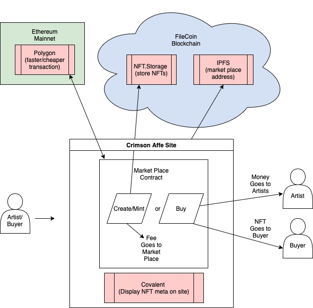

# Crimson-Affe

## Table of contents

* [About](#about)

* [Tech](#Tech)

* [Sponsors](#sponsors)

* [Architechture](#architecture)

* [Setup](#setup)

## About

A NFT market place for organizations that hosts art show events. This project is a model as a service to facilitate art show organizations in the adoption of blockchain technology and incorporate additional revenue stream for their vendors

## Tech

* [React](https://reactjs.org/)

* [Solidity](https://docs.soliditylang.org/en/latest/)

* [Hardhat](https://hardhat.org/)

* [Ethers](https://docs.ethers.io/v5/)

* [Infura](https://infura.io/)

* [Open Zeppelin](https://openzeppelin.com/contracts/)

## Sponsors

* [Protocol Labs](https://protocol.ai/)

* [nft.storage](https://nft.storage/)

* [Polygon](https://polygon.technology/)

## Architecture



## Setup

Clone repo

``` bash
git clone git@github.com:Shih-Yu/Crimson-Affe.git
```

Change into directory

``` bash
cd Crimson-Affe
```

* [ ]Install project dependecies

``` bash
npm i
```

Create .env for connecting to testnet/mainnet

Deploy contract to testnet/mainnet with hardhat

``` bash
npx hardhat run scripts/deploy.js --network <testnet/mainnet>
```

Get contract address for interaction from the front end

In a separate terminal, start the server for React

``` bash
npm start
```
